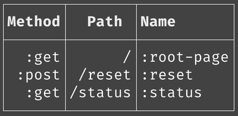

[](http://clojars.org/org.clj-commons/pretty)
[](https://github.com/clj-commons/pretty/actions/workflows/clojure.yml)
[](https://cljdoc.org/d/org.clj-commons/pretty/)

*Sometimes, neatness counts*

If you are trying to puzzle out a stack trace, 
pick a critical line of text out of a long stream of console output,
or compare two streams of binary data, a little bit of formatting can go a long way.

That's what `org.clj-commons/pretty` is for.  It adds support for pretty output where it counts:

* Readable output for exceptions
* General ANSI font and background color support
* Readable output for binary sequences


Or, compare an example from
[Pedestal](http://github.com/pedestal/pedestal)'s test suite:


Or, same thing, but with Pretty enabled:


The point is, you can scan down to see things in chronological order; the important parts are highlighted, the names are the same (or closer) to your source code, unnecessary details are omitted, and it's much easier to pick out other essential parts easily, such as file names and line numbers.

### Enabling Pretty

Pretty exceptions are enabled by invoking the fucntion `clj-commons.pretty.repl/install-pretty-exceptions`.  This
redefines a number of Vars to replace the default implementations with prettier ones.  This is something you could
set up in your `user.clj` namespace.

### Pretty with Leiningen

In shared projects, many people have different ideas about what's best when it comes to error reporting.
If you want to be able to use Pretty but have your project's dependencies be "clean", you can use 
a [Leiningen](https://leiningen.org/) profile for this purpose.

For example, create a file `~/.lein/profiles.d/debug.clj`:

```clojure
{:dependencies
 [[org.clj-commons/pretty "3.5.0"]]
 :injections
 [(require '[clj-commons.pretty.repl :as repl])
  (repl/install-pretty-exceptions)]}
```
You can then run your REPL as `lein with-profiles +debug` and have your pretty
exceptions without adding pretty-specific code or dependencies to your project.

TIP: I also set up other tools I depend on, such as 
[clj-reload](https://github.com/tonsky/clj-reload), in the same profile.

### Pretty with clj

```clojure
{:aliases
 { :debug
  {:extra-deps {org.clj-commons/pretty {:mvn/version "3.5.0"}}
   :main-opts ["--main" "clj-commons.pretty-repl"]}}}
```
Executing `clj -M:debug` will execute the function `clj-commons.pretty-repl/-main` which will set up
pretty exceptions before passing any remaining command line argments to `clojure.main/main`.

Alternately, for use with the -X option:

```clojure
{:aliases
 {:debug
  {:extra-deps {org.clj-commons/pretty {:mvn/version "3.5.0"}}
   :exec-fn clj-commons.pretty.repl/main}
  
  :test
  {:extra-paths ["test"]
   :extra-deps {io.github.cognitect-labs/test-runner
                {:git/tag "v0.5.1" :git/sha "dfb30dd"}}
   :exec-fn cognitect.test-runner.api/test
   :exec-args {:fn cognitect.test-runner.api/test}}}}
```

This allows testing with pretty as `clj -X:test:debug`.

`clj -X:test` is normal execution, and the `clj` tool will directly invoke the `cognitect.test-runner.api/test` function.
`clj -X:test:debug` will overwrite the :exec-fn to invoke the `clj-commons.pretty.repl/main` function, which will
set up pretty exceptions before delegating to the function specified with the :fn option.

The value for :fn must be a fully qualified function name.

Both of these approaches are doable but clumsy, so a solution involving nREPL directly will likely be better.


### Pretty with nREPL

[nREPL](https://nrepl.org) is the framework that allows an IDE such as [Emacs](https://cider.mx/) 
or [Cursive](https://cursive-ide.com/), or even a CLI such as
Leiningen, to interoperate with a running REPL in a subprocess.

Pretty includes an nREPL middleware function, `clj-commons.pretty.nrepl/wrap-pretty`, that will install pretty exception reporting into the REPL.  

The nREPL documentation describes how to enable such middleware
inside [project.clj or deps.edn](https://nrepl.org/nrepl/usage/server.html#starting-a-server) or
in [.nrepl/nrepl.edn](https://nrepl.org/nrepl/usage/server.html#server-configuration) (for instance, when developing
with [Cursive](https://cursive-ide.com/userguide/repl.html#configuring-middleware-for-nrepl-repls))

## Beyond Exceptions

Pretty can print out a sequence of bytes; it includes color-coding inspired by
[hexyl](https://github.com/sharkdp/hexyl):


Pretty can also print out a delta of two byte sequences, using background color
to indicate where the two sequences differ.


Pretty can output pretty tabular data:

```
(def routes
  [{:method     :get
    :path       "/"
    :route-name :root-page}
   {:method     :post
    :path       "/reset"
    :route-name :reset}
   {:method     :get
    :path       "/status"
    :route-name :status}])
(print-table
  [:method
   :path
   {:key :route-name :title "Name" :title-align :left}]
  routes)

```



The `print-table` function has many options to easily adjust the output to your needs, including fonts, text alignment, and line annotations. It also supplies several different table styles:

```
(print-table
    {:columns [:method
               :path
               {:key :route-name :title "Name" :title-align :left}]
     :style   table/skinny-style}
    routes)
Method |   Path  | Name      
-------+---------+-----------
  :get |       / | :root-page
 :post |  /reset | :reset    
  :get | /status | :status   
=> nil
```

Pretty can also format text with annotations, useful when reporting errors while
parsing arbitrary text:


## Compatibility

Pretty is compatible with Clojure 1.10 and above.

Parts of Pretty can be used with [Babashka](https://book.babashka.org/#introduction), such as the `clj-commons.ansi`
namespace; however, Babashka runs in an interpreter and its approach to exceptions is
incompatible with JVM exceptions.

## License

The majority of this code is available under the terms of the Apache Software License 1.0; some portions
are available under the terms of the Eclipse Public Licence 1.0.

