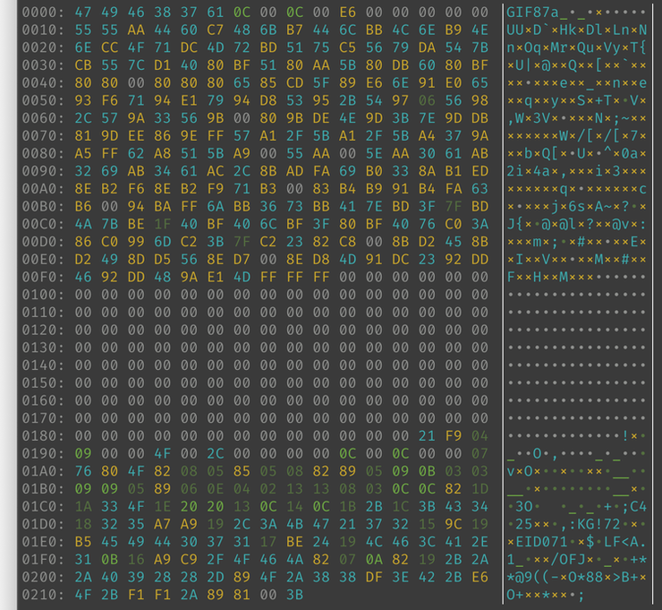

[](http://clojars.org/org.clj-commons/pretty)
[](https://github.com/clj-commons/pretty/actions/workflows/clojure.yml)
[](https://cljdoc.org/d/org.clj-commons/pretty/)

*Sometimes, neatness counts*

If you are trying to puzzle out a stack trace, 
pick a critical line of text out of a long stream of console output,
or compare two streams of binary data, a little bit of formatting can go a long way.

That's what `org.clj-commons/pretty` is for.  It adds support for pretty output where it counts:

* Readable output for exceptions
* General ANSI font and background color support
* Readable output for binary sequences


Or, compare an example from
[Pedestal](http://github.com/pedestal/pedestal)'s test suite:


Or, same thing, but with Pretty enabled:


The point is, you can scan down to see things in chronological order; the important parts are highlighted, the names are the same (or closer) to your source code, unnecessary details are omitted, and it's much easier to pick out the most important parts, such as file names and line numbers.

## Pretty and nREPL

[nREPL](https://nrepl.org) is the framework that allows an IDE such as [Emacs](https://cider.mx/) 
or [Cursive](https://cursive-ide.com/) to interoperate with a running
REPL in a subprocess.

Pretty includes an nREPL middleware function, `clj-commons.pretty.nrepl/wrap-pretty` that will install pretty exception reporting into the REPL.  

The nREPL documentation describes how to enable such middleware
inside [project.clj or deps.edn](https://nrepl.org/nrepl/usage/server.html#starting-a-server) or
in [.nrepl/nrepl.edn](https://nrepl.org/nrepl/usage/server.html#server-configuration) (for instance, when developing
with [Cursive](https://cursive-ide.com/userguide/repl.html#configuring-middleware-for-nrepl-repls))

## Beyond Exceptions

Pretty can print out a sequence of bytes; it includes color-coding inspired by
[hexyl](https://github.com/sharkdp/hexyl):



Pretty can also print out a delta of two byte sequences, using background color
to indicate where the two sequences differ.


Pretty can output pretty tabular data:

```
(def routes
  [{:method     :get
    :path       "/"
    :route-name :root-page}
   {:method     :post
    :path       "/reset"
    :route-name :reset}
   {:method     :get
    :path       "/status"
    :route-name :status}])
=> #'table-demo/routes
(print-table
  [:method
   :path
   {:key :route-name :title "Name" :title-align :left}]
  routes)
┌────────┬─────────┬────────────┐
│ Method │   Path  │ Name       │
├────────┼─────────┼────────────┤
│   :get │       / │ :root-page │
│  :post │  /reset │ :reset     │
│   :get │ /status │ :status    │
└────────┴─────────┴────────────┘
=> nil
```

The `print-table` function has many options to easily adjust the output to your needs, including fonts, text alignment, and line annotations. It also supplies several different table styles:

```
(print-table
    {:columns [:method
               :path
               {:key :route-name :title "Name" :title-align :left}]
     :style   table/skinny-style}
    routes)
Method |   Path  | Name      
-------+---------+-----------
  :get |       / | :root-page
 :post |  /reset | :reset    
  :get | /status | :status   
=> nil
```


## Compatibility

Pretty is compatible with Clojure 1.10 and above.

Parts of Pretty can be used with [Babashka](https://book.babashka.org/#introduction), such as the `clj-commons.ansi`
namespace; however, Babashka runs in an interpreter and its approach to exceptions is
incompatible with JVM exceptions.

## License

The majority of this code is available under the terms of the Apache Software License 1.0; some portions
are available under the terms of the Eclipse Public Licence 1.0.

