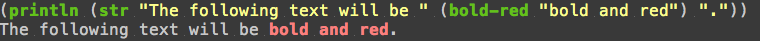

ANSI Formatting
===============

The ``io.aviso.ansi`` namespace defines a number of functions and constants for producing
`ANSI escape codes <https://en.wikipedia.org/wiki/ANSI_escape_code>`_.

For each of the supported colors (black, red, green, yellow, blue, magenta, cyan, and white) there will be four functions and four constants:

* *color* - function to set text color
* *color*-bg - function to set background color
* bold-*color* - function to set enable bold text and the text color
* bold-*color*-bg - function to enable bold text and the background color
* *color*-font - constant that enables the text color
* *color*-bg-font - constant that enables the color as background
* bold-*color*-font - constant that enables the text color in bold
* bold-*color*-bg-font - constant that enables the bold color as background

The functions are passed a string and wrap the string with ANSI codes to enable an ANSI graphic representation for the text, with a reset after the text.

Note that the exact color interpretation of the ANSI codes varies significantly between platforms and applications, and
is frequently configurable, often using themes.
You may need to adjust your application's settings to get an optimum display.

In addition there are functions `bold`, `inverse`, and `italic` and constants `bold-font`, `inverse-font`, `italic-font`, and `reset-font`.

The above example could also be written as:

.. code-block:: clojure

   (println (str "The following text will be " bold-red-font "bold and red" reset-font "."))
