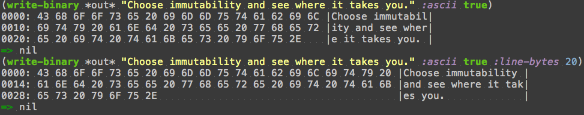
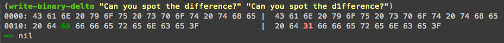

Binary Output
=============

The ``io.aviso.binary`` namespace provides support output of binary data.

Binary data is represented using the protocol BinaryData; this protocol is extended on byte arrays, on String, and on nil.
BinaryData is simply a randomly accessible collection of bytes, with a known length.

.. code-block:: clojure

    (write-binary "Choose immutability and see where it takes you.")

::

  0000: 43 68 6F 6F 73 65 20 69 6D 6D 75 74 61 62 69 6C 69 74 79 20 61 6E 64 20 73 65 65 20 77 68 65 72
  0020: 65 20 69 74 20 74 61 6B 65 73 20 79 6F 75 2E

``write-binary`` can write to a java.io.Writer (defaulting to ``*out*``) or a
StringBuilder
(or other things, as defined by the StringWriter protocol).
The full version explicitly specifies where to write to, as well as options:

Alternately, ``format-binary`` will return the formatted binary output string.

You can also compare two binary data values with ``write-binary-delta``:

If the two data are of different lengths, the shorter one is padded with ``--`` to make up the difference.

As with ``write-binary``, there's a ``format-binary-delta``, and a three-argument version of ``write-binary-delta``
for specifying a StringWriter target.
