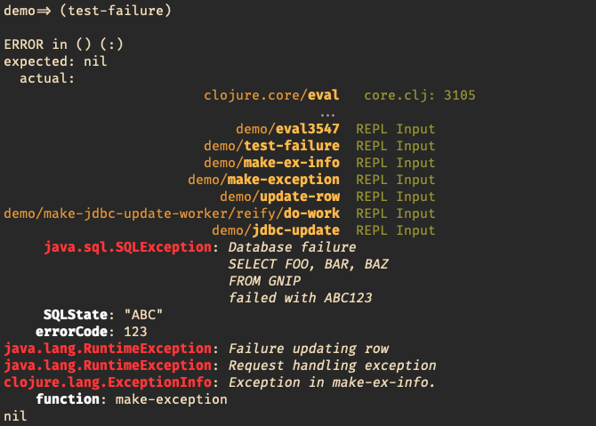
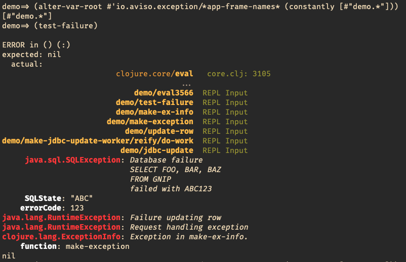

Formatted Exceptions
====================

Pretty's main focus is on formatting of exceptions for readability, addressing one of Clojure's core weaknesses.

Rationale
---------

Exceptions in Clojure are extremely painful for many reasons:

* They are often nested (wrapped and rethrown)
* Stack traces are output for every exception, which clogs output without providing useful detail
* Stack traces are often truncated, requiring the user to manually re-assemble the stack trace from several pieces
* Many stack frames represent implementation details of Clojure that are not relevant

This is addressed by the ``io.aviso.exception/write-exception`` function; it take an exception
and writes it to the console, ``*out*``.

This is best explained by example; here's a SQLException wrapped inside two RuntimeExceptions, and printed normally:

::

  user=> (throw (make-ex-info))
  Execution error (SQLException) at user/jdbc-update (REPL:1).
  Database failure
  SELECT FOO, BAR, BAZ
  FROM GNIP
  failed with ABC123
  user=> (pst)
  SQLException Database failure
  SELECT FOO, BAR, BAZ
  FROM GNIP
  failed with ABC123
  	user/jdbc-update (NO_SOURCE_FILE:1)
  	user/jdbc-update (NO_SOURCE_FILE:1)
  	user/make-jdbc-update-worker/reify--169 (NO_SOURCE_FILE:5)
  	user/update-row (NO_SOURCE_FILE:4)
  	user/update-row (NO_SOURCE_FILE:1)
  	user/make-exception (NO_SOURCE_FILE:5)
  	user/make-exception (NO_SOURCE_FILE:1)
  	user/make-ex-info (NO_SOURCE_FILE:5)
  	user/make-ex-info (NO_SOURCE_FILE:1)
  	user/eval175 (NO_SOURCE_FILE:1)
  	user/eval175 (NO_SOURCE_FILE:1)
  	clojure.lang.Compiler.eval (Compiler.java:7176)
  nil
  user=> *clojure-version*
  {:major 1, :minor 10, :incremental 0, :qualifier nil}
  user=>

This is greatly improved in Clojure 1.10 over prior Clojure releases, but still quite minimal.

On a good day, the exception messages will include all the details you need to resolve the problem, which
is strangely at odds with Clojure's ``ex-info`` function; ``ex-info` encourages you to
put useful information into the `ex-data` of the exception, yet Clojure doesn't print out this data.
``write-exceptions`` by contrast, does output the ``ex-data``.

Meanwhile, you will have to mentally scan and parse the above text explosion, to parse out file names and line numbers.

It's one more bit of cognitive load you just don't need in your day.

Instead, here's the equivalent, using a *hooked* version of Clojure's ``clojure.repl/pst``,
modified to use ``write-exception``.

.. image:: images/formatted-exception.png
   :alt: Formatted Exception

As you can see, this lets you focus in on the exact cause and location of your problem.
.
``write-exception`` flips around the traditional order, providing a chronologically sequential view:

* The stack trace leading to the root exception comes first, and is ordered outermost frame to innermost frame.

* The exception stack comes after the stack trace, and is ordered root exception (innermost) to outermost, reflecting how the
  stack has unwound, and the root exception was wrapped in new exceptions and rethrown.

The stack trace is carefully formatted for readability, with the left-most column identifying Clojure functions
or Java class and method, and the right columns presenting the file name and line number.

The stack frames themselves are filtered to remove details that are not relevant.
This filtering is via an optional function, so you can define filters that make sense for your code.
For example, the default filter omits frames in the clojure.lang package (they are reduced to ellipses), and truncates the
stack trace when when it reaches ``clojure.main/repl/read-eval-print``.

Repeating stack frames are also identified and reduced to a single line (that identifies the number of frames).
This allows your infinite loop that terminates with a StackOverflowException to be reported in just a few lines, not
thousands.

The inverted (from Java norms) ordering has several benefits:

* Chronological order is maintained, whereas a Java stack trace is in reverse chronological order.

* The most relevant details are at (or near) the *bottom* not the *top*; this means less "scrolling back to see what happened".

The related function, ``format-exception``, produces the same output, but returns it as a string.

For both ``format-exception`` and ``write-exception``, output of the stack trace is optional, or can be limited to a certain number of stack frames.

Frames can also be highlighted by customizing ``io.aviso.exception/*app-frame-names*``. This adds extra visual clarity to identify frames that belong in your Clojure
code vs. library code.

Before:

After:

Notice with custom app-frame-names, the matched frame names are also in bold font. This is customized by re-binding or altering
``*app-frame-names*``, which is a list of string or patterns to match on the frame's name.

::

  ;; marks any frame that begins with demo
  (alter-var-root #'io.aviso.exception/*app-frame-names* (constantly [#"my-app.*"]))

io.aviso.repl
-------------

This namespace includes a function, ``install-pretty-exceptions``, which
hooks into all the common ways that exceptions are output in Clojure and redirects them to use write-exception.

When exceptions occur, they are printed out without a stack trace or properties.
The ``clojure.repl/pst`` function is overridden to fully print the exception (*with* properties and stack trace).

In addition, ``clojure.stacktrace/print-stack-trace`` and ``clojure.stacktrace/print-cause-trace`` are overwritten; these
are used by ``clojure.test``. Both do the same thing: print out the full exception (again,
with properties and stack trace).

You may not need to invoke this directly, as
pretty can also act as a :doc:`lein-plugin`.

io.aviso.logging
----------------

This namespace includes functions to change ``clojure.tools.logging`` to use Pretty to output exceptions, and to add a
default Thread.UncaughtExceptionHandler that uses ``clojure.tools.logging``.
